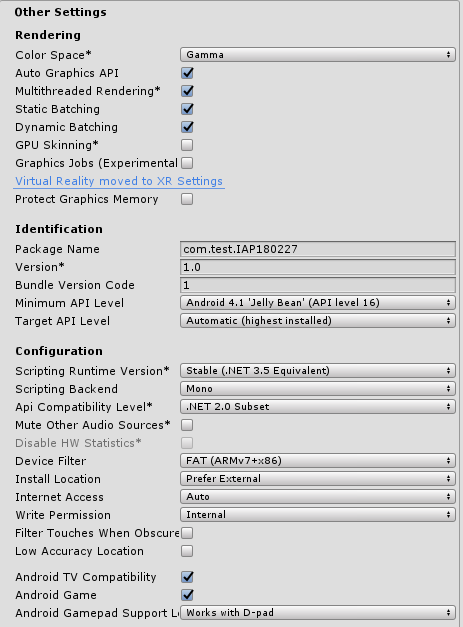
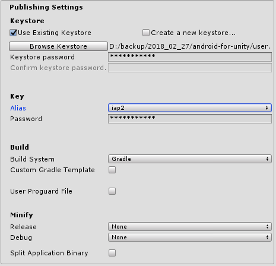

## IAP Android create apk

### PlayerSettingsの変更

 
 

__Package Nameをユニークな名前で作成する。__

 
 

__Google Consoleでアルファテストクローズド用に提出するために、keystoreを作成__

※次回からも作成したkeystoreを使用しないと、apkのアップロードができなくなるので、
なくさないようにするべき。

一度`Create a new keystore...`で作成した後、Uesr Existing Keystoreで
作成したkeystoreを選択する

 
 

__apk作成中にAndroid SDK toolsでエラーがでた場合__

https://answers.unity.com/questions/1323731/unable-to-list-target-platforms-please-make-sure-t.html

 
 

__release apk closed α test__

- Google play Consoleへの登録。 月額とかではなく初回のみに支払う。$25 = 2800円ぐらい? vプリカでいける。
- Google Play Consoleでアプリ情報の作成。
- アプリ公開に必要な情報をすべて記入。
- アプリのリリースからクローズドアルファ版テストでapkをアップロード -> 公開。
- テスターの管理からクローズドアルファ版テスト選択。
- リスト名, メールアドレスを保存。
- オプトインURLからテスターがアクセスする。
- アプリをインストールする。