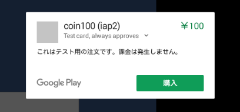
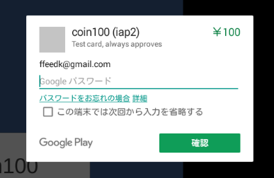
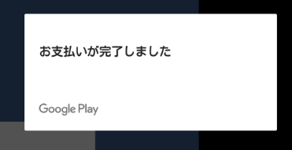

## Google Console / Android / IAP 実装確認

- アプリ名 iap2
- バンドルID com.test.IAP180227
- アイテム coin100 com.arakaki.iaptest.coin100
- アイテム coin500 com.arakaki.iaptest.coin500


<br>
<br>

__通常起動時__

IAPの初期化が行われる。

```log
I/UnityIAP( 7578): onQueryInventoryFinished: true
I/UnityIAP( 7578): Inventory refresh successful. (response: 0:OK)
I/Unity   ( 7578): [SUCCESS] OnInitialized
I/Unity   ( 7578):
I/Unity   ( 7578): (Filename: /Users/builduser/buildslave/unity/build/artifacts/generated/common/runtime/DebugBindings.gen.cpp Line: 51)
I/Unity   ( 7578):
I/Unity   ( 7578): UnityIAP: Unity Ads not present, Promotional placements not possible
I/Unity   ( 7578):
I/Unity   ( 7578): (Filename: /Users/builduser/buildslave/unity/build/artifacts/generated/common/runtime/DebugBindings.gen.cpp Line: 51)
I/Unity   ( 7578):
```

<br>
<br>

__coin100クリック時__



```log
I/UnityIAP( 7979): onPurchaseProduct: com.arakaki.iaptest.coin100
I/UnityIAP( 7979): ITEM TYPE:inapp
D/GuidanceScreen( 1941): mBstOemFeatures === 2107393
I/Unity   ( 7979): purchase({0}): com.arakaki.iaptest.coin100
I/Unity   ( 7979):
I/Unity   ( 7979): (Filename: /Users/builduser/buildslave/unity/build/artifacts/generated/common/runtime/DebugBindings.gen.cpp Line: 51)
I/Unity   ( 7979):
I/UnityIAP( 7979): isUnityVrEnabled = false
```

<br>
<br>

__パスワードを入力して購入__





```log
I/UnityIAP( 7979): onActivityResult
I/UnityIAP( 7979): Successful resultcode from purchase activity.
I/UnityIAP( 7979): Purchase data: {"orderId":"GPA.3389-3328-1442-81245","packageName":"com.test.IAP180227","productId":"com.arakaki.iaptest.coin100","purchaseTime":1519714497417,"purchaseState":0,"purchaseToken":"mbhingaffiblmileiedpcmcf.AO-J1OzQOzuQbrpsc8XBMRGND6bOKbqked2vV3d6F3oJKvzISzC3VArpnnptDqZkJ_LmltA5gWgRzORWrxv8v1DztukHv5SbruJknbwCLk3y2MSaOm_Ez0en_Z5LbpoT6WX2lpzn9W2d"}
I/UnityIAP( 7979): Data signature: WKOryMMqeGn8mJBA29K8VKchQ9KYj3py/3yhqYben8cWNX/kFjWkrRnlnN8Lqwakn1pwGXDYbMkRh3zcCAn2lFsOfKQRllBM69Xqg+3xb4B583DxR2wBtWcCNiEuiATGjYFo3WK6jcwRqcE8NDOhs/0QfKQFragBAdEvhUYMwztSmkKuoYkUvKm4sEKrjSfvqC4YTOZY8PQhvVlWBHQAfOg79IfiQAWMbqvqn+lC9Hwi5E6Z7caBw+Gnuy1rGESahzj4edOvbMxvuQz5XkSX5nyEYVhDj3kUm8tVEwtF7w8ZLpX/T6qVvtrBTHHLx1mEYJ27INVIoivMwymxfF4V5Q==
I/UnityIAP( 7979): Extras: Bundle[{INAPP_PURCHASE_DATA={"orderId":"GPA.3389-3328-1442-81245","packageName":"com.test.IAP180227","productId":"com.arakaki.iaptest.coin100","purchaseTime":1519714497417,"purchaseState":0,"purchaseToken":"mbhingaffiblmileiedpcmcf.AO-J1OzQOzuQbrpsc8XBMRGND6bOKbqked2vV3d6F3oJKvzISzC3VArpnnptDqZkJ_LmltA5gWgRzORWrxv8v1DztukHv5SbruJknbwCLk3y2MSaOm_Ez0en_Z5LbpoT6WX2lpzn9W2d"}, INAPP_DATA_SIGNATURE=WKOryMMqeGn8mJBA29K8VKchQ9KYj3py/3yhqYben8cWNX/kFjWkrRnlnN8Lqwakn1pwGXDYbMkRh3zcCAn2lFsOfKQRllBM69Xqg+3xb4B583DxR2wBtWcCNiEuiATGjYFo3WK6jcwRqcE8NDOhs/0QfKQFragBAdEvhUYMwztSmkKuoYkUvKm4sEKrjSfvqC4YTOZY8PQhvVlWBHQAfOg79IfiQAWMbqvqn+lC9Hwi5E6Z7caBw+Gnuy1rGESahzj4edOvbMxvuQz5XkSX5nyEYVhDj3kUm8tVEwtF7w8ZLpX/T6qVvtrBTHHLx1mEYJ27INVIoivMwymxfF4V5Q==, RESPONSE_CODE=0}]
I/UnityIAP( 7979): Expected item type: inapp
D/BstCommandProcessor-Service( 1929): startService called with arg: GIAPPurchaseData
I/UnityIAP( 7979): onIabPurchaseFinished: true
I/UnityIAP( 7979): Success (response: 0:OK)
I/UnityIAP( 7979): Product purchased successfully!
I/UnityIAP( 7979): NotifyUnityOfPurchase
```

<br>
<br>

__その後にProcessPurchaseを通ってくる__


```log
I/Unity   ( 7979): [SUCCESS]: validateReceipt com.arakaki.iaptest.coin100
I/Unity   ( 7979):
I/Unity   ( 7979): (Filename: /Users/builduser/buildslave/unity/build/artifacts/generated/common/runtime/DebugBindings.gen.cpp Line: 51)
I/Unity   ( 7979):
I/UnityIAP( 7979): Finish transaction:GPA.3389-3328-1442-81245
I/UnityIAP( 7979): Consuming com.arakaki.iaptest.coin100
I/UnityIAP( 7979): invoking callback
I/UnityIAP( 7979): Consuming sku: com.arakaki.iaptest.coin100, token: mbhingaffiblmileiedpcmcf.AO-J1OzQOzuQbrpsc8XBMRGND6bOKbqked2vV3d6F3oJ
I/Finsky  ( 5339): [330] com.google.android.finsky.billing.iab.x.b(31): com.test.IAP180227: Account determined from installer data - [4VtY4WyBPHoloeCy81LcamMuH3c]
I/WindowManager( 1501): Not Changing default density value for app : com.test.IAP180227 isCustomDpiApp: false density : 240
I/Finsky  ( 5339): [1] com.google.android.finsky.cb.a.af.a(6): Applying library update: account=[4VtY4WyBPHoloeCy81LcamMuH3c]
I/Finsky  ( 5339): [1] com.google.android.finsky.ag.h.a(3): App library has changed, requesting content sync.
I/UnityIAP( 7979): Successfully consumed sku: com.arakaki.iaptest.coin100
I/UnityIAP( 7979): onConsumeFinished:true
I/UnityIAP( 7979): Successful consume of sku com.arakaki.iaptest.coin100 (response: 0:OK)
I/UnityIAP( 7979): 0 
```

<br>
<br>

__購入中に落ちた場合の起動時__

初期化後に、ProcessPurchaseが走る。
購入は終わっているので、レシート検証と購入時のアイテム解放などの成功処理が走る。
この処理は非同期で走るため、グローバルなデータ管理が必要と思われる。

```log
I/UnityIAP( 7738): onQueryInventoryFinished: true
I/UnityIAP( 7738): Inventory refresh successful. (response: 0:OK)
I/Unity   ( 7738): [SUCCESS] OnInitialized
I/Unity   ( 7738):
I/Unity   ( 7738): (Filename: /Users/builduser/buildslave/unity/build/artifacts/generated/common/runtime/DebugBindings.gen.cpp Line: 51)
I/Unity   ( 7738):
I/Unity   ( 7738): [SUCCESS]: validateReceipt com.arakaki.iaptest.coin100
I/Unity   ( 7738):
I/Unity   ( 7738): (Filename: /Users/builduser/buildslave/unity/build/artifacts/generated/common/runtime/DebugBindings.gen.cpp Line: 51)
I/Unity   ( 7738):
I/UnityIAP( 7738): Finish transaction:GPA.3397-6489-5795-86773
I/UnityIAP( 7738): Consuming com.arakaki.iaptest.coin100
I/UnityIAP( 7738): invoking callback
I/UnityIAP( 7738): Consuming sku: com.arakaki.iaptest.coin100, token: cphcdekemepjnkjajfgjekil.AO-J1OzGKPXLzGGAtTsblGxLqRdEXUeM2EhQ6JPPgZkVv0_1X56o4zeGCqtD6qqFKG23meQ1ihjk9_Hf4dgKhVl9InZM3cUNVgeVMYUr4qKToAUV7QNaX8eVWLob-w-2ungO1RY4cVYF
I/Finsky  ( 5339): [330] com.google.android.finsky.billing.iab.x.b(31): com.test.IAP180227: Account determined from installer data - [4VtY4WyBPHoloeCy81LcamMuH3c]
I/Unity   ( 7738): UnityIAP: Unity Ads not present, Promotional placements not possible
I/Unity   ( 7738):
I/Unity   ( 7738): (Filename: /Users/builduser/buildslave/unity/build/artifacts/generated/common/runtime/DebugBindings.gen.cpp Line: 51)
I/Unity   ( 7738):
D/dalvikvm( 7738): GC_CONCURRENT freed 484K, 19% free 3174K/3872K, paused 0ms+0ms, total 4ms
D/dalvikvm( 2025): GC_CONCURRENT freed 1170K, 37% free 4481K/7052K, paused 1ms+1ms, total 8ms
D/dalvikvm( 7738): GC_FOR_ALLOC freed 419K, 25% free 3038K/4004K, paused 3ms, total 3ms
D/dalvikvm( 7738): GC_FOR_ALLOC freed 470K, 21% free 3179K/4004K, paused 2ms, total 2ms
D/dalvikvm( 7738): GC_FOR_ALLOC freed 286K, 21% free 3180K/4004K, paused 2ms, total 3ms
I/Finsky  ( 5339): [1] com.google.android.finsky.cb.a.af.a(6): Applying library update: account=[4VtY4WyBPHoloeCy81LcamMuH3c]
I/Finsky  ( 5339): [1] com.google.android.finsky.ag.h.a(3): App library has changed, requesting content sync.
I/UnityIAP( 7738): Successfully consumed sku: com.arakaki.iaptest.coin100
I/UnityIAP( 7738): onConsumeFinished:true
I/UnityIAP( 7738): Successful consume of sku com.arakaki.iaptest.coin100 (response: 0:OK)
I/UnityIAP( 7738): 0
```

